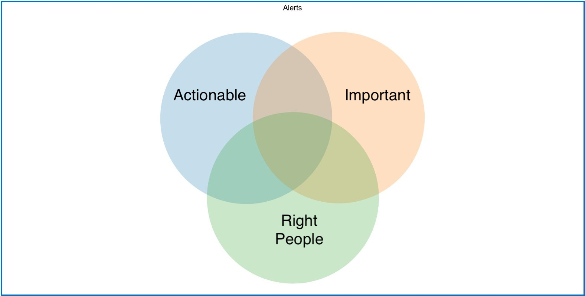

build-lists: true
footer: Error Culture
slidenumbers: true
autoscale: true

# Error Culture

---

# Introduction

- I'm Ryan Cheley

--- 

# Introduction

- Senior Regional Director of Business Informatics

^ notes: I'm the Senior Regional Director of Business Informatics ... but that just means I'm a 

---

# Introduction

- ~~Senior Regional Director of Business Informatics~~
- Director of Enginnering

^ notes: I'm the Senior Regional Director of Business Informatics ... but that just means I'm a 

---

# Error Culture

^ notes: Today I'm going to be talking about Error Culture. 

---

# What?

^notes: Specifically what it is

---

# Where?

^ notes: how to tell if you're in an orgnization that suffers from it

---
# How?

^ notes: how to get out it

---

# What is it?

---

A culture that **accepts** error notifications and **ignores** them, encouraging a **reactive**, instead of **proactive** culture of problem solving

---

# Why is it bad? 

- Signal : Noise Ratio
- waiting until it (💩) hits the fan

^notes: Encourages the creationg of low signal to noise ratio for alerting
^notes: not fixing problem until they are big, bad problems

---

# Why does it happen?

- Lack of Understanding of 
    - what the error is
    - why it's important
    - who it impacts

---

# Why does it happen?

- Error Fatigue

---

# Why does it happen?

- Emphasis on Hero Culture

---


^notes: we find our hero finding a problem

---


^notes: we find our hero watching the problem get bigger

---


^notes: and bigger

---


^notes: our hero notifies everyone about the problem

---


^notes: our hero fixes the problem

---


^notes: our hero is recognized for their efforts; 

---


^notes: how many of you have ever been the person the the left? How many of you have been the person on the right? which one *feels* better? which one is actually better for problem solving? 

---

# Who does this happen to?

---

# People in Tech

- Developers
- Help Desk Folks
- Sys Admins
- Network Admins
- CTOs

^ notes: Since we're at a tech conference, the obvious answer is folks in tech. This can be ....

---

# Office workers

- Administrative Assistants
- Data Anlysts
- Account Managers
- C Suite Execs

^ notes: but you might not realize this has the potential to happen in other areas of life as well. 

---

# Anyone

- honestly this can happen to just about anyone!

---

# When does it start?

- Internal Reasons
- External Reasons

---

# Internal

- Example here

^ When someone decides that ‘we’ need to be notified of when ‘this’ happens again


---

# Internal

- Insert alert / image here
- Invalid Zip Code Alert

^ When an alert is created because it ‘might’ be useful but doesn’t provide full context for why

---

# Internal

```
-----Original Message-----
From: misadmin 
Sent: Monday, July 22, 2024 4:51 PM
To: ETL Notifications 
Subject: SQL Server Alert System: 'db-p-001 Alert - Sev 20 Error: Fatal Error in Current Process' occurred on \\path

DATE/TIME:    7/22/2024 4:50:32 PM

DESCRIPTION:    The prelogin packet used to open the connection is structurally invalid; the connection has been closed. Please contact the vendor of the client library. [CLIENT: IP Address]


COMMENT:    (None)

JOB RUN:    (None)
```

^ Sometimes you just get opted into Alerts and aren't notified

---


# External

- Example here

^ When a consultant indicates that it is ‘best practice’ to be notified of an alert but doesn’t provide more context


---

# External

- Example here

^ When defaults for external software come with enabled alerts but no context or steps for resolution


---

# How can I tell ...

^ if I'm in an error culture

---

# Question 1

- Example of an email from a no-reply email address

^ Do you receive emails or alerts from no-reply style email addresses where your first reaction is to just delete them

---

# Question 2

- Example of an email from a no-reply email address with the rule that just deletes it

^ Do you get 'smart' and create a rule to get rid of that email so you don't have to see it any more? 

---

# Question 3

```
-----Original Message-----
From: misadmin 
Sent: Monday, July 22, 2024 4:51 PM
To: ETL Notifications 
Subject: SQL Server Alert System: 'db-p-001 Alert - Sev 20 Error: Fatal Error in Current Process' occurred on \\path

DATE/TIME:    7/22/2024 4:50:32 PM

DESCRIPTION:    The prelogin packet used to open the connection is structurally invalid; the connection has been closed. Please contact the vendor of the client library. [CLIENT: IP Address]


COMMENT:    (None)

JOB RUN:    (None)
```

Do you know why you receive alerts or errors? 

---

# Question 3a


```
We received this error message and have no clue what process kicked it off, what failed, or what to do about it.
```

^ We asked what the alert was ... 


---
# Question 3b


```
a process was running last night that caused errors like this on several servers. It was scanning for vulnerabilities. Sorry for the inconvenience.
```

^ ... and received a response


---

# Question 3d


```
Please remove ETL-Notifications from this email alert since it is not related to anything we do and there is nothing we can do to resolve.
```

^ ... then, having the neccesary information and detemrining that it isn't anything we could do anything about, asked to be removed from the alert


---

# Question 4

- Example here


^ Do you see others around you put out fires that you knew were coming?


---

# Am I there? 

---

<!--
# Spoiler Alert

^ Spoiler alert: if any of these situations looked familiar then maybe you are


---
-->

# If you answered 

---

# Yes

^ to one or more of the questions from before

---

# You're in an error culture

---

# What can be done to fix it? 

---

# Good news

- IC
- CTO

^ No matter where you are in the 'ladder' at work (i.e. IC, or CTO) you can make a change

---

# Where to start?

---


^ change should not be made until the reasoning behind the current state of affairs is understood

---

# Ask Questions


---

# Is it important? 

- No

---

# Delete It

- Not Just the Alert
- Mechanism of the Alert

^ Don't just set up a rules to delete the alert, delete the mechanism that sends the alert


---

# Is it important? 

- Yes

^ This is great! We have an alert that *is* important

---

# Is it Actionable?

^ What does an actionable alert look like? 

---

# In General

- Verb

---

# Bad 

Subject: Super Important Alert about Server! 
Message: The server is unresponsive!

^ Which server? 

---

# Better

Subject: Super Important Alert about Server! 
Message: The server do-web-t-005 is unresponsive

^ We know **which** server now, but what am I supposed to do about it?  

---

# Best 

Subject: Super Important Alert about Server! 
Message: The server do-web-t-005 is unresponsive. To resolve this **do** X

^ an actionable alert should have a verb in it ... i.e. the server is unresponse. To fix this, **reboot** the server ... The verb here is reboot

---

# Actionable Alert!

^ we have an actionable alert now, but do we know WHY we have the alert? If not, we should determine the **WHY** and document it

--- 

# Why?

- ... is it important? 

^ knowing why an alert exists can help you to determine if it's still needed in the future

---

# Best

Subject: Super Important Alert about Server! 
Message: The server do-web-t-005 is unresponsive. To resolve this **do** X. 
See [this link](https://www.example.com) for details on the alert.

---

# This Link (example 1)

The server `do-web-t-005` is a test server on Digital Ocean. It is used for project ABC which is set to be retired on October 1, 2024

^ hmmm ... maybe this alert isn't important anymore

---

# This Link (example 2)

The server `do-web-t-005` is a production server on Digital Ocean. It is a mission critical server for claims payments

^ oh no ... drop everything and get this taken care of now! 

---

# Who?

- ... who should be notified? 

^ - make sure the *right* people are being notified

---

# Best 

Subject: Super Important Alert about Server! 
Message: The server do-web-t-005 is unresponsive. To resolve this **do** X


---

# Wrong people

- Claims team 
- Business Analyst
- Developer

^ The Claims team and the Business Analyst can't do anything; given the security infrastructure, the developer might not be able to do anything either! 

---

# Right people

- Server Admin

^ this is a person that can actually perform the action of **do** from above

---

# Best

- Actionable
- Important
- Right People

^ The best alerts are:
- actionable with a VERB
- have their importance / why documented in our KMS
- are sent to the *right* people

---

# Venn Diagram



^ notes: need more here

--- 

# Conclusion

## Error Culture can feel 

- Pervasive

^ notes:
Error Culture is / can be pervasive. 

--- 

# Conclusion

## But you 

- Can escape

^ notes:
But you CAN escape


--- 

# Conclusion

## By asking

- Questions

^ notes:
Ask questions to make sure that alerts are actionable, documented, and sent people that can actually resolve the problem! 

---

# Special Thanks

- Adrienne Franke
- Carolyn Zimmerman
- Mario Munoz
- Trey Hunner

---

# Find Me

    - [website](https://ryancheley.com/)
    - [mastadon](https://mastodon.social/@ryancheley)
    - [linkedin](https://www.linkedin.com/in/ryan-cheley/)


---

# Questions

Questions? 