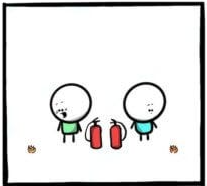
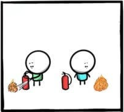
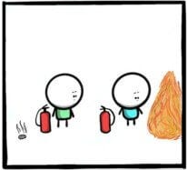
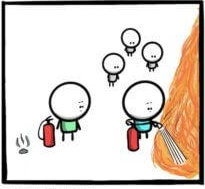
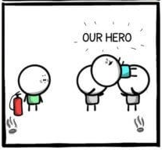

build-lists: true
footer: Error Culture
slidenumbers: true
autoscale: true

# Error Culture

---

# Introduction

- I'm Ryan Cheley
- I'm the Senior Regional Director of Business Informatics ... but that just means I'm a Director of Enginnering
- You can find me here:

    - website
    - mastadon
    - linkedin

---

# Error Culture

^ notes: welcome to my talk 'Error Culter'. Today I'm going to be talking about Error Culture. Specifically what it is, how to tell if you're in an orgnization that suffers from it, and how to get out it

# What is it?

---

> A culture that **accepts** error notifications and **ignores** them, encouraging a **reactive**, instead of **proactive** culture of problem solving

---

# Why is it bad? 

- Signal : Noise Ratio
- waiting until it hits the fan

^notes: Encourages the creationg of low signal to noise ratio for alerting
^notes: **potentially** problems to not be fixed until they are bad problems

---

# Why does it happen?

- Lack of Understanding of 
    - what the error is
    - why it's important
    - who it impacts

---

# Why does it happen?

- Error Fatigue

---

# Why does it happen?

- Emphasis on Hero Culture

---

^notes: we find our hero finding a problem

---

^notes: we find our hero watching the problem get bigger

---

^notes: and bigger

---

^notes: our hero notifies everyone about the problem

---

^notes: our hero fixes the problem

---

^notes: our hero is recognized for their efforts; how many of you have ever been the person the the left? How many of you have been the person on the right? which one *feels* better? 

---

# Who does this happen to?

---

# People in Tech

- Developers
- Help Desk Folks
- Sys Admins
- Network Admins

^ notes: Since we're at a tech conference, the obvious answer is folks in tech. This can be ....

---

# Office workers

- Administrative Assistants
- Data Anlysts
- Account Managers
- C Suite Execs

^ notes: but you might not realize this has the potential to happen in other areas of life as well. 

---

# Anyone

- honestly this can happen to just about anyone!

---

# When does it start?

- Internal Reasons
- External Reasons

---

# Internal

- Example here

^ When someone decides that ‘we’ need to be notified of when ‘this’ happens again

---

# Internal

- Insert alert / image here
- Invalid Zip Code Alert

^ When an alert is created because it ‘might’ be useful but doesn’t provide full context for why

---

# Internal

- Example here

^ When too many alerts are created without context for what the errors are

---

# External

- Example here

^ When a consultant indicates that it is ‘best practice’ to be notified of an alert but doesn’t provide more context

---

# External

- Example here

^ When defaults for external software come with enabled alerts but no context or steps for resolution

---

# How can I tell ...

^ if I'm in an error culture

---

# Question 1

- Example of an email from a no-reply email address

^ Do you receive emails or alerts from no-reply style email addresses where your first reaction is to just delete them

---

# Question 2

- Example of an email from a no-reply email address with the rule that just deletes it

^ Do you get 'smart' and create a rule to get rid of that email so you don't have to see it any more? 

---

# Question 3

- The fangledorn is klapfachta

^ the example should show this ridiculous message and then 'zoom' out to show that it's sent to a distribution list, and then zoom out to show that the distribution list includes all of the developers 
^ Do you know why you receive alerts or errors? 

---

# Question 4

- Example here

^ Do you see others around you put out fires that you knew were coming?

---

# Am I there? 

---

# Spoiler Alert

^ Spoiler alert: if any of these situations looked familiar then maybe you are

---

# If you answered 
# Yes

^ to one or more of the questions from before

---

# What can be done to fix it? 

- IC
- CTO

^ No matter where you are in the 'ladder' at work (i.e. IC, or CTO) you can make a change

---

# Where to start?

---

# Ask Questions

---

# Is it important? 

- Important
- Delete it
- It == Alert
- It == Mechanism of the Alert

^ notes: 
- Is the alert you are getting Actually Important? 
- If it is NOT important, delete it.
- Not just the alert, but the mechanism for the alert
- Be mindful of Chesteron's fence here though! 

---

# Chesteron's Fence

Explanation goes here

---

# It is important

But is it actionable? 

If YES

- Make sure the error indicates what needs to be fixed
- make sure the error indicates why it's important
- make sure the *right* people are being notified

If NO

- update it to be actionable
- include
    - Steps to resolution or documentation link for resolving the error
    - Update the alert to indicate it’s importance
    - Update the alert to go to the correct people

---

# Resources

---

# Questions

Questions? 