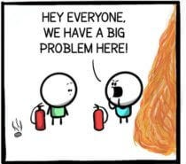

build-lists: true
footer: footer text
slidenumbers: true

# Error Culture

---

# Introduction

- I'm Ryan Cheley
- I'm the Senior Regional Director of Business Informatics ... but that just means I'm a Director of Enginnering
- You can find me here:

    - website
    - mastadon
    - linkedin

---

# Error Culture

^ notes: welcome to my talk 'Error Culter'. Today I'm going to be talking about Error Culture. Specifically what it is, how to tell if you're in an orgnization that suffers from it, and how to get out it

# What is it?

---

> A culture that **accepts** error notifications and **ignores** them, encouraging a **reactive** instead of **proactive** culture of problem solving

---

# Why is it bad? 

- Encourages the creationg of low signal to noise ratio for alerting
- allows **potentially** really bad problems to not be fixed until they are really bad
- It can encourage 'Hero Culture'

---

# Hero Culture Slide

^notes: we find our hero finding a problem

---
# Hero Culture Slide

^notes: we find our hero watching the problem get bigger

---
# Hero Culture Slide

^notes: and bigger

---
# Hero Culture Slide

^notes: our hero notifies everyone about the problem

---
# Hero Culture Slide

^notes: our hero fixes the problem

---
# Hero Culture Slide

^notes: our hero is recognized for their efforts; how many of you have ever been the person the the left? How many of you have been the person on the right? which one *feels* better? 

---

# Why does it happen?

- Error Fatigue

---
# Why does it happen?

- Lack of Understanding of 
    - what the error is
    - why it's important
    - who it impacts

---

# Why does it happen?

- Emphasis on Hero Culture, [see](https://naksecurity.medium.com/the-detriments-of-hero-culture-3fc455963d6e)

---

# Who does this happen to?

---

# People in Tech

- Developers
- Help Desk Folks
- Sys Admins
- Network Admins

^ notes: Since we're at a tech conference, the obvious answer is folks in tech. This can be ....

---

# Office workers

- Administrative Assistants
- Data Anlysts
- Account Maangers
- C Suite Execs

^ notes: but you might not realize this has the potential to happen in other areas of life as well. 

---

# Anyone

- honestly this can happen to just about anyone!

---

# When does it start?

- Internal Reasons
- External Reasons

---

# Internal

- When someone decides that ‘we’ need to be notified of when ‘this’ happens again
    - Example here
---

# Internal

- When an alert is created because it ‘might’ be useful but doesn’t provide full context for why
    - Invalid Zip Code Alert

---

# Internal

- When too many alerts are created without context for what the errors are
    - Example here

---

# External

- When a consultant indicates that it is ‘best practice’ to be notified of an alert but doesn’t provide more context
    - Example here

---

# External

- When defaults for external software come with enabled alerts but no context or steps for resolution
    - Example here

---

# How can I tell if I'm in an error culture

---

# Question 1

- Do you receive emails or alerts from no-reply style email addresses that you have email rules that just delete them?
    - Example here

---

# Question 2

- Do you receive emails or alerts from no-reply style email addresses where your first reaction is to just delete them
    - Example here

---

# Question 3

- Do you see others around you put out fires that you knew were coming?
    - Example here

---

# Question 4

- Do you know why you receive alerts or errors? 
    - Example here

---

# Am I there? 

Any of these can point to you being part of an Error Culture.

---

# What can be done to fix it? 

No matter where you are in the 'ladder' at work (i.e. IC, or CTO) you can make a change

---

# Start here

- Is the alert you are getting Actually Important? 
- If it is NOT important, delete it.
- Not just the alert, but the mechanism for the alert
- Be mindful of Chesteron's fence here though! 

---

# Chesteron's Fence

Explanation goes here

---

# It is important

But is it actionable? 

If YES

- Make sure the error indicates what needs to be fixed
- make sure the error indicates why it's important
- make sure the *right* people are being notified

If NO

- update it to be actionable
- include
    - Steps to resolution or documentation link for resolving the error
    - Update the alert to indicate it’s importance
    - Update the alert to go to the correct people

---

# Resources

---

# Questions

Questions? 